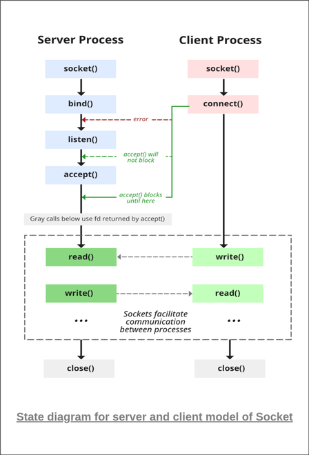

# Socket Programming

Socket programming is a way of connecting two nodes on a network to communicate with each other. One socket(node) listens on a particular port at an IP, while the other socket reaches out to the other to form a connection. The server forms the listener socket while the client reaches out to the server.

State diagram for server and client model of Socket




## Stages for server

1. Socket creation:

``` c
int sockfd = socket(domain, type, protocol)
```

- sockfd: socket descriptor, an integer (like a file-handle)
- domain: integer, specifies communication domain. We use AF_ LOCAL as defined in the POSIX standard for communication between processes on the same host. For communicating between processes on different hosts connected by IPV4, we use AF_INET and AF_I NET 6 for processes connected by IPV6.
- type: communication type
  - SOCK_STREAM: TCP(reliable, connection oriented)
  - SOCK_DGRAM: UDP(unreliable, connectionless)
- protocol: Protocol value for Internet Protocol(IP), which is 0. This is the same number which appears on protocol field in the IP header of a packet.(man protocols for more details)

2. Setsockopt:

This helps in manipulating options for the socket referred by the file descriptor sockfd. This is completely optional, but it helps in reuse of address and port. Prevents error such as: “address already in use”.

``` c
int setsockopt(int sockfd, int level, int optname,  const void *optval, socklen_t optlen);
```

3. Bind:

``` c
int bind(int sockfd, const struct sockaddr *addr, socklen_t addrlen);
```

After the creation of the socket, the bind function binds the socket to the address and port number specified in addr(custom data structure). In the example code, we bind the server to the localhost, hence we use INADDR_ANY to specify the IP address.

4. Listen:

``` c
int listen(int sockfd, int backlog);
```

It puts the server socket in a passive mode, where it waits for the client to approach the server to make a connection. The backlog, defines the maximum length to which the queue of pending connections for sockfd may grow. If a connection request arrives when the queue is full, the client may receive an error with an indication of ECONNREFUSED.

5. Accept:

``` c
int new_socket= accept(int sockfd, struct sockaddr *addr, socklen_t *addrlen);
```

It extracts the first connection request on the queue of pending connections for the listening socket, sockfd, creates a new connected socket, and returns a new file descriptor referring to that socket. At this point, the connection is established between client and server, and they are ready to transfer data.

## Stages for Client

- Socket connection: Exactly same as that of server’s socket creation
- Connect: The connect() system call connects the socket referred to by the file descriptor sockfd to the address specified by addr. Server’s address and port is specified in addr.

``` c
int connect(int sockfd, const struct sockaddr *addr, socklen_t addrlen);
```


## Implementation
Here we are exchanging one hello message between server and client to demonstrate the client/server model.

Server.c

``` c
// Server side C/C++ program to demonstrate Socket
// programming
#include <netinet/in.h>
#include <stdio.h>
#include <stdlib.h>
#include <string.h>
#include <sys/socket.h>
#include <unistd.h>
#define PORT 8080
int main(int argc, char const* argv[])
{
    int server_fd, new_socket, valread;
    struct sockaddr_in address;
    int opt = 1;
    int addrlen = sizeof(address);
    char buffer[1024] = { 0 };
    char* hello = "Hello from server";

    // Creating socket file descriptor
    if ((server_fd = socket(AF_INET, SOCK_STREAM, 0)) < 0) {
        perror("socket failed");
        exit(EXIT_FAILURE);
    }

    // Forcefully attaching socket to the port 8080
    if (setsockopt(server_fd, SOL_SOCKET,
                   SO_REUSEADDR | SO_REUSEPORT, &opt,
                   sizeof(opt))) {
        perror("setsockopt");
        exit(EXIT_FAILURE);
    }
    address.sin_family = AF_INET;
    address.sin_addr.s_addr = INADDR_ANY;
    address.sin_port = htons(PORT);

    // Forcefully attaching socket to the port 8080
    if (bind(server_fd, (struct sockaddr*)&address,
             sizeof(address))
        < 0) {
        perror("bind failed");
        exit(EXIT_FAILURE);
    }
    if (listen(server_fd, 3) < 0) {
        perror("listen");
        exit(EXIT_FAILURE);
    }
    if ((new_socket
         = accept(server_fd, (struct sockaddr*)&address,
                  (socklen_t*)&addrlen))
        < 0) {
        perror("accept");
        exit(EXIT_FAILURE);
    }
    valread = read(new_socket, buffer, 1024);
    printf("%s\n", buffer);
    send(new_socket, hello, strlen(hello), 0);
    printf("Hello message sent\n");

    // closing the connected socket
    close(new_socket);
    // closing the listening socket
    shutdown(server_fd, SHUT_RDWR);
    return 0;
}
```

client.c

``` c
// Client side C/C++ program to demonstrate Socket
// programming
#include <arpa/inet.h>
#include <stdio.h>
#include <string.h>
#include <sys/socket.h>
#include <unistd.h>
#define PORT 8080

int main(int argc, char const* argv[])
{
    int status, valread, client_fd;
    struct sockaddr_in serv_addr;
    char* hello = "Hello from client";
    char buffer[1024] = { 0 };
    if ((client_fd = socket(AF_INET, SOCK_STREAM, 0)) < 0) {
        printf("\n Socket creation error \n");
        return -1;
    }

    serv_addr.sin_family = AF_INET;
    serv_addr.sin_port = htons(PORT);

    // Convert IPv4 and IPv6 addresses from text to binary
    // form
    if (inet_pton(AF_INET, "127.0.0.1", &serv_addr.sin_addr)
        <= 0) {
        printf(
            "\nInvalid address/ Address not supported \n");
        return -1;
    }

    if ((status
         = connect(client_fd, (struct sockaddr*)&serv_addr,
                   sizeof(serv_addr)))
        < 0) {
        printf("\nConnection Failed \n");
        return -1;
    }
    send(client_fd, hello, strlen(hello), 0);
    printf("Hello message sent\n");
    valread = read(client_fd, buffer, 1024);
    printf("%s\n", buffer);

    // closing the connected socket
    close(client_fd);
    return 0;
}
```

Compiling:

```console
gcc client.c -o client
gcc server.c -o server
```

Output:

```console
Client:Hello message sent
Hello from server
Server:Hello from client
Hello message sent
```

## Select()


## Reference

- https://www.cs.rpi.edu/~moorthy/Courses/os98/Pgms/socket.html